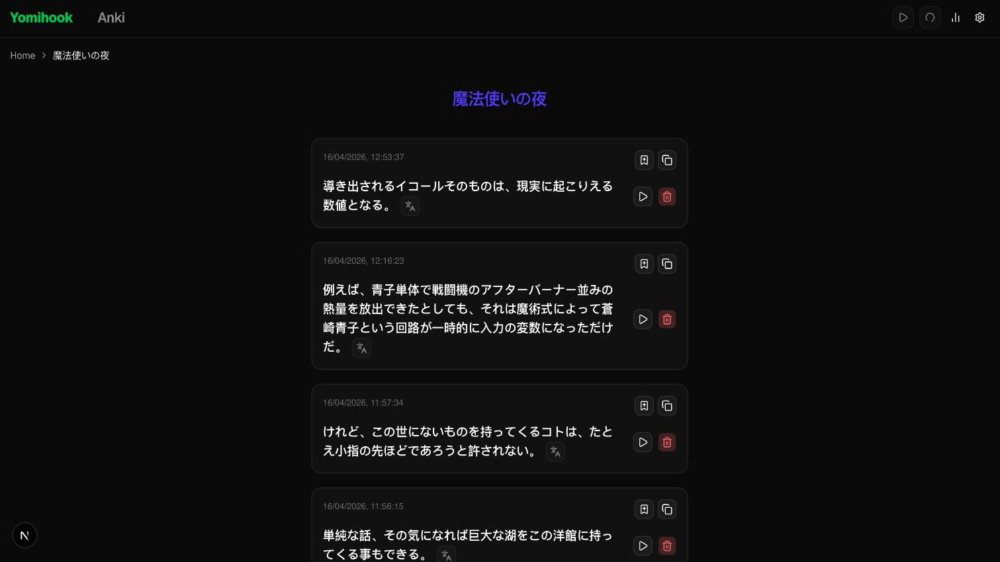

# Yomihooker

A Japanese reading tool that hooks into a local text-hook server, displays captured text with machine translations, plays TTS audio via VOICEVOX, and mines vocabulary cards into Anki.

## Features

- **Text hooking** — connects via WebSocket to [LunaTranslator](https://github.com/HIllya51/LunaTranslator) and displays captured text in real time
- **Machine translation** — fetches and shows translations alongside each hooked line
- **TTS playback** — synthesizes Japanese audio through a local VOICEVOX engine
- **Anki card mining** — captures a screenshot, generates TTS audio, and pre-fills an Anki note via AnkiConnect with one click
- **Deck management** — organise sessions into named decks; messages are persisted in a local SQLite database
- **Reading stats** — tracks character count for the active deck

## Preview



## Prerequisites

The following services must be running locally before starting Yomihooker:

| Service                                                      | Default port | Purpose                                   |
| ------------------------------------------------------------ | ------------ | ----------------------------------------- |
| [LunaTranslator](https://github.com/HIllya51/LunaTranslator) | 2333         | WebSocket text hook + machine translation |
| [VOICEVOX](https://voicevox.hiroshiba.jp/)                   | 50021        | Japanese TTS synthesis                    |
| [AnkiConnect](https://foosoft.net/projects/anki-connect/)    | 8765         | Anki note read/write                      |

Ports can be changed in the in-app settings (gear icon in the navbar) or directly in `config.toml`.

## Getting Started

```bash
npm install
npx prisma generate --config ./prisma/config.ts
npx prisma db push --config ./prisma/config.ts
npm run dev
```

Open [http://localhost:3000](http://localhost:3000) in your browser.

## Configuration

`config.toml` at the project root is the single source of truth for service ports. It has two sections:

- **Active settings** (`[lunatranslator]`, `[voicevox]`, `[anki_connect]`) — written by the in-app settings UI
- **Reset targets** (`[defaults.*]`) — never overwritten by the UI; edit manually to change what "Reset defaults" restores

## Database

Yomihooker uses SQLite via Prisma 7 and `@prisma/adapter-libsql`. The local database file lives at `data/data.db` and is gitignored, so every new checkout needs its own database file.

### First-time setup

Run these commands from the project root:

```bash
npm install
npx prisma generate --config ./prisma/config.ts
npx prisma db push --config ./prisma/config.ts
```

What these do:

- `npm install` installs Prisma, the libsql adapter, and the generated-client dependencies.
- `prisma generate` creates the local Prisma client used by the app.
- `prisma db push` creates `data/data.db` and syncs it with `prisma/schema.prisma`.

This project does not use Prisma migrations yet. After changing `prisma/schema.prisma`, run:

```bash
npx prisma db push --config ./prisma/config.ts
```

### Optional legacy import

If you have old JSON deck data in `data/decks.json` and `data/decks/*/messages.json`, import it with:

```bash
npx prisma db seed --config ./prisma/config.ts
```

### Troubleshooting

If the app shows an error like:

```text
ConnectionFailed("Unable to open connection to local database data/data.db: 14")
```

make sure the database exists:

```bash
mkdir data
npx prisma db push --config ./prisma/config.ts
```

On Windows PowerShell, use this if `mkdir data` reports that the folder already exists:

```powershell
New-Item -ItemType Directory -Force data
npx prisma db push --config ./prisma/config.ts
```

## Tech Stack

- [Next.js](https://nextjs.org/) 16 (App Router)
- [Prisma](https://www.prisma.io/) 7 + SQLite via `@prisma/adapter-libsql`
- [Tailwind CSS](https://tailwindcss.com/) v4
- [shadcn/ui](https://ui.shadcn.com/) components
- [smol-toml](https://github.com/nicolo-ribaudo/smol-toml) for config file I/O
